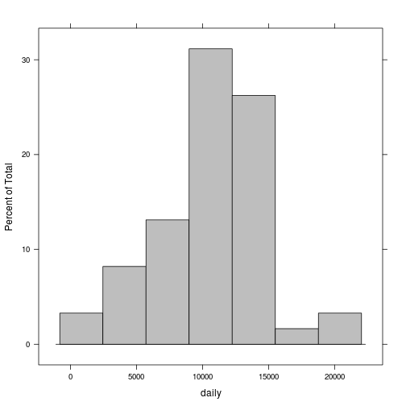
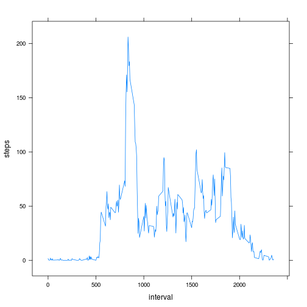
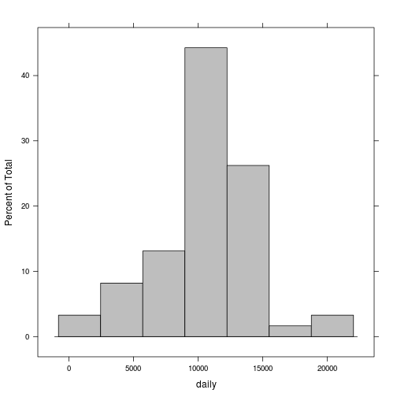

## Loading and preprocessing the data
Data was loaded from the csv file. The "date" column was converted to "Date" class objects.

```r
act=read.csv("activity.csv")
act=transform(act, date=as.Date(date))
```

## What is mean total number of steps taken per day?
Number of steps taken each day was calculated and used to plot the histogram.

```r
daily=tapply(act$steps, act$date, sum)
library(lattice)
histogram(daily, col = "grey")
```

 

The mean number of steps daily was:

```r
mean(daily, na.rm=TRUE)
```

```
## [1] 10766.19
```

and the median:

```r
median(daily, na.rm=TRUE)
```

```
## [1] 10765
```

## What is the average daily activity pattern?
Average number of steps per interval over days was calculated and shown in the plot:

```r
pattern=aggregate(act$steps, list(act$interval), mean, na.rm=T)
names(pattern)=c("interval", "steps")
xyplot(steps ~ interval, data=pattern, type="l")
```

 

The maximal average number of steps was observed at the interval number:

```r
pattern$interval[which.max(pattern$steps)]
```

```
## [1] 835
```

## Imputing missing values
The dataset contained the following number of missing values:

```r
sum(is.na(act$steps))
```

```
## [1] 2304
```

The missing numbers of steps were filled with the average number for the certain interval calculated over all days:

```r
int=act$interval[is.na(act$steps)]
act$steps[is.na(act$steps)]=pattern$steps[match(int, pattern$interval)]
```

And the histogram of the daily steps number was plotted again:

```r
daily=tapply(act$steps, act$date, sum)
histogram(daily, col = "grey")
```

 

The mean number of steps daily was:

```r
mean(daily, na.rm=TRUE)
```

```
## [1] 10766.19
```

and the median:

```r
median(daily, na.rm=TRUE)
```

```
## [1] 10766.19
```

The mean and the median of the number of steps taken daily didn't change significantly, but the distribution differs after adding the missing values: the pool of the days with the number of steps close to the average increased.

## Are there differences in activity patterns between weekdays and weekends?
A factor variable indicating the weekday and the weekend was added to the data frame:

```r
wdays=weekdays(act$date)
wdays=sapply(wdays, function(x){
    if (x %in% c("Saturday", "Sunday")) "weekend" else "weekday"})
act=data.frame(act, wdays)
```

and the average steps per interval over days was calculated separately for the weekdays and weekends:

```r
wpattern=aggregate(act$steps, list(act$interval, act$wdays), mean)
names(wpattern)=c("interval", "wdays", "steps")
```

Both patterns were compared on the plot:

```r
xyplot(steps ~ interval | wdays, data=wpattern, type="l")
```

 

Increased activity can be observed in the morning hours during the week can be observed while during the weekend the activity is spread over the day.
